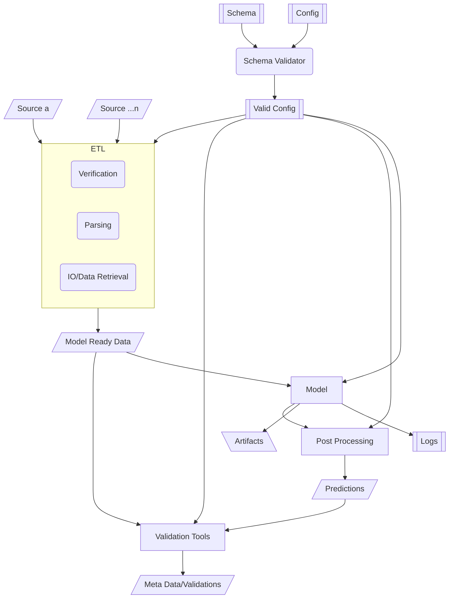

# Architecture

Modeling projects that grow bottom up rarely have a singular architecture that
one might point to that would make it feel like that was a master plan from
the beginning. It is also a bing part of regular code maintenance to take what
is in a repository and reconcile it with an architecture.

## General Observations

### Complexity

The classes defined in DynODE range in level of complexity. Some inherit ABC
others are more vanilla. This is not to say tat ABC's don't have their place,
but it can be confusing when an AbstractInitializer is an ABC and the
AbstractParameters is a vanilla class. It appears that a library dedicated to
a single model has a lot of variability in the way OOP is being used. This can
create a lot of complexity where it isn;t needed.

On the other hand, functional utilities lack formality and rigor, which might
be also summed up as a need for elegant patterns and OOP patterns to curb
the entropy.

### Modularization

The file structure for this repo is rather flat with a lot of specificity to
file naming. This is because the repo is not attempting to reflect architectural
abstractions. More modularity will help with the development of maintainable
software.

This modularization should also be reflected in tests.

### The Importance of Clear Configuration

Many DS teams struggle with moving from software used by a small group to
software made from mass consumption. One very common pattern for software
designed to operate in a data pipeline is the use of very clear configurations
to make the software operation declarative. The configuration then is the main
interface to the operator. This is where there is a lot of opportunity for
DynODE (any pretty much every project at CFA).

## A proposed Architectural Plan

Taking the previous sections as a call to action for refactoring and
updating this codebase, the following is a rough architectural schematic for
where I think we can go with DyneODE v1.0.

